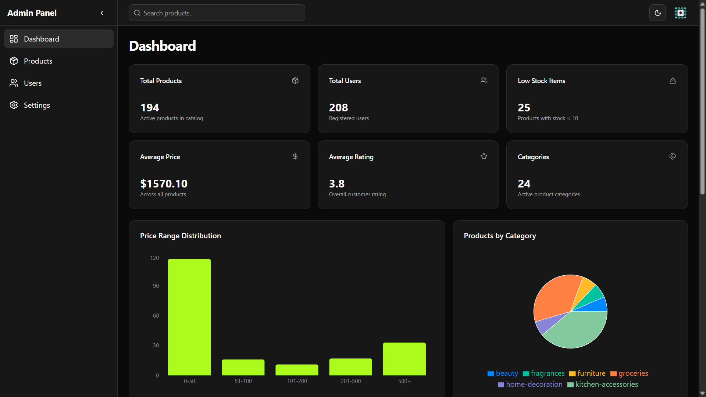

# Product Management Dashboard

A comprehensive Admin Dashboard built with React 18, TypeScript, and ShadCN UI for managing e-commerce products. This project demonstrates production-ready architecture, robust state management with TanStack Query, and secure authentication flows.



## 🚀 Key Features

- **Authentication**:
  - Secure Login with JWT (Access + Refresh Tokens).
  - Automatic silent token refresh mechanism using Axios interceptors.
  - Protected routes and session persistence.
- **Product Management**:
  - **CRUD Operations**: Create, Read, Update, and Delete products.
  - **Advanced Filtering**: Server-side pagination, search, and category filtering.
  - **Optimistic Updates**: Immediate UI feedback for better UX.
  - **Image Upload**: Integration with Cloudinary for handling product images.
- **Dashboard**:
  - Visual statistics and charts using Recharts.
  - Recent product activity tracking.
- **User Management**:
  - View user lists with details (Read-only module).
- **Settings**:
  - Theme toggle (Light/Dark mode) persisted in local storage.
  - Application settings configuration.
- **Responsive Design**:
  - Fully responsive layout for Desktop, Tablet, and Mobile.
  - Collapsible sidebar navigation.

## 🛠 Tech Stack

- **Framework**: [React 18](https://react.dev/)
- **Build Tool**: [Vite](https://vitejs.dev/)
- **Language**: [TypeScript](https://www.typescriptlang.org/) (Strict Mode)
- **UI Components**: [ShadCN UI](https://ui.shadcn.com/) (Radix UI + Tailwind CSS)
- **Styling**: [Tailwind CSS](https://tailwindcss.com/)
- **State Management**:
  - Server State: [TanStack Query (React Query)](https://tanstack.com/query/latest)
  - Form State: [React Hook Form](https://react-hook-form.com/) + [Zod](https://zod.dev/)
- **Routing**: [React Router DOM v6](https://reactrouter.com/)
- **HTTP Client**: [Axios](https://axios-http.com/)
- **Icons**: [Lucide React](https://lucide.dev/)
- **Charts**: [Recharts](https://recharts.org/)
- **Feedback**: [Sonner](https://sonner.emilkowal.ski/) (Toast notifications)

## 📂 Project Structure

The project follows a feature-based modular architecture for scalability and maintainability.

```
src/
├── api/                # API configuration (Axios instance forms foundation)
│   └── axios.ts        # Axios setup with interceptors for token refresh
├── assets/             # Static assets (images, fonts)
├── components/         # Reusable UI components
│   ├── ui/             # ShadCN primitive components
│   ├── layout/         # Layout components (Sidebar, Navbar, ProtectedRoute)
│   └── ...             # Feature-specific components
├── config/             # Configuration files (constants, env vars)
├── hooks/              # Custom React hooks
├── pages/              # Page components (routed views)
│   ├── dashboard/      # Dashboard view
│   ├── login/          # Login view
│   ├── Products/       # Product management views (List, Add, Edit)
│   ├── User/           # User management views
│   └── settings/       # Settings view
├── services/           # Service layer for API calls
├── types/              # TypeScript type definitions
└── App.tsx             # Main application component with routing
```

## ⚙️ Setup Instructions

### Prerequisites

- Node.js (v18 or higher)
- npm or yarn

### Installation

1.  **Clone the repository:**

    ```bash
    git clone <repository-url>
    cd product-dashboard
    ```

2.  **Install dependencies:**

    ```bash
    npm install
    ```

3.  **Environment Setup:**
    Create a `.env` file in the root directory based on `.env.example`:

    ```env
    VITE_API_BASE_URL=https://dummyjson.com
    VITE_CLOUDINARY_CLOUD_NAME=your_cloud_name
    VITE_CLOUDINARY_UPLOAD_PRESET=your_upload_preset
    ```

4.  **Run the development server:**
    ```bash
    npm run dev
    ```
    Open [http://localhost:5173](http://localhost:5173) in your browser.

## 🔐 Authentication & Token Refresh

The application implements a robust JWT-based authentication flow.

- **Login**: On successful login, `accessToken` and `refreshToken` are stored in `localStorage`.
- **Interceptors**:
  - **Request Interceptor**: Automatically attaches the `Authorization: Bearer <token>` header to every outgoing request.
  - **Response Interceptor**: Listens for `401 Unauthorized` responses.
- **Auto-Refresh Logic**:
  1.  If a request fails with 401, the interceptor pauses the request.
  2.  It attempts to call `/auth/refresh` using the stored `refreshToken`.
  3.  If successful, it updates the tokens in `localStorage` and retries the original failed request with the new token.
  4.  If refresh fails (e.g., refresh token expired), the user is redirected to `/login`.

## 🏗 Architecture Decisions

- **Component Composition**: We use shadcn/ui for atomic components to ensure accessibility and consistent design while allowing full customization via Tailwind.
- **Service Layer Pattern**: API calls are abstracted into `services/` (e.g., `user.service.ts`), keeping components clean and focused on UI logic.
- **TanStack Query**: Used for data fetching to handle caching, loading states, and side effects efficiently, reducing the need for global state management like Redux for server data.
- **Route Protection**: High-order components (`ProtectedRoute`) wrap authenticated routes to ensure security.

## 🚀 Deployment

The project is optimized for deployment on platforms like Vercel or Netlify.

**Build for production:**

```bash
npm run build
```

**Preview production build:**

```bash
npm run preview
```

## ⚖️ Trade-offs & Future Improvements

1.  **Authentication Storage**: Currently using `localStorage` for simplicity in storing JWTs. A more secure approach for production would be `httpOnly` cookies to prevent XSS attacks.
2.  **State Management**: For this scale, React Context/Zustand + TanStack Query is sufficient. As the app grows, a more strictly defined global store might be beneficial for complex cross-component interactions.
3.  **Image Upload**: Direct upload to Cloudinary from the client is implemented. A backend proxy could be added to secure API keys and validate files more strictly.
4.  **Testing**: Comprehensive Unit and E2E tests were skipped for speed but are critical for a production app.

## 📸 Screenshots

_(Add screenshots of your Dashboard, Product List, and Edit Page here)_

---

**Developed for Aptech Solutions Assessment**
